<div align="center">

# 🚀 Endpoint Detection System (EDS)  
### for Cyber-Resilient Autonomous Vehicles  

[](https://creativecommons.org/licenses/by-nc-nd/4.0/)
[](https://www.python.org/downloads/)
[](https://github.com/yourusername/eds-av)

</div>

---

<div align="center">

### 📄 Official Implementation of our Research Paper  
**"Cyber-Resilient Autonomous Vehicles: Securing Networks and Enhancing Decision-Making with Next-Gen Security Measures"**  
*Published in Results in Engineering (2025)*  
📌 DOI: [10.1016/j.rineng.2025.107179](https://doi.org/10.1016/j.rineng.2025.107179)

</div>

---

## ✨ About this Repository  

This repository provides a **complete end-to-end Python framework** implementing the **Endpoint Detection System (EDS)** proposed in our paper.  

🔹 **Synthetic Dataset Generator** – mimics the **CICEV2023 DDoS Attack Dataset**  
🔹 **Multi-Model Machine Learning Framework** – for real-time attack detection  
🔹 **Custom Visualization Functions** – replicating the figures and styles from our publication  

---


## 📊 Project Flow Diagram

A high-level overview of the EDS pipeline:

```mermaid
graph TD
    %% --- Main Flowchart Definition ---

    A[("📊<br/><b>Dataset Generation</b><br/>CICEV2023 Synthetic Data<br/>15K Samples | 50+ Features")]
    --> B("⚙️<br/><b>Preprocessing</b><br/>Scaling, Encoding &<br/>80/20 Stratified Split")
    --> C("🧠<br/><b>Model Training</b><br/>Random Forest, SVM, NN, GB<br/>with Cross-Validation")
    --> D("🎯<br/><b>Threat Detection & Evaluation</b><br/>Accuracy, Precision, Recall, F1<br/>Confusion Matrix Analysis")
    --> E("📈<br/><b>Visualizations</b><br/>Fig 6: Attack Distribution<br/>Fig 7: Correlation Heatmap<br/>Fig 8: Confusion Matrix")
    --> F[/💾<br/><b>Final Outputs</b><br/>CSV Dataset & Model Results<br/>Saved Figures & Reports/]

    %% --- Styling Section ---

    %% Style definitions for different node types
    classDef dataStyle fill:#f0f7ff,stroke:#4a90e2,stroke-width:2px,color:#333
    classDef processStyle fill:#ffffff,stroke:#4a90e2,stroke-width:2px,color:#333
    classDef outputStyle fill:#e7f5e7,stroke:#2e7d32,stroke-width:2px,color:#333

    %% Apply styles to the nodes
    class A dataStyle
    class B,C,D,E processStyle
    class F outputStyle

    %% Style the arrows/links
    linkStyle default stroke:#4a90e2,stroke-width:2px
```


This flow ensures scalability for AV ecosystems, handling sensor fusion, V2X communications, and OTA vulnerabilities with minimal latency.

---

## 📈 Key Visualizations

Our implementation faithfully recreates the paper's figures using the synthetic data.

#### Figure 6: Distribution of Different Attack Types in the Dataset
This bar chart illustrates the balanced-yet-realistic attack distribution (e.g., ~30% Benign, 25% DDoS), highlighting the dataset's focus on minority-class threats for robust model training.


#### Figure 7: Heatmap Showing Correlation Between Features
A correlation matrix of key network features (e.g., `SYN Flag Count`, `Flow Pkts/s`), revealing patterns like high SYN-DoS correlations. It uses a `coolwarm` colormap for intuitive threat signal identification.


#### Figure 8: Confusion Matrix Representing Model Performance
The Random Forest model's confusion matrix on test data, showcasing per-class accuracy. The `Blues` colormap emphasizes misclassifications for iterative improvements.


#### Table 1: Performance Metrics Comparison
Printed to the console and derived from evaluation—an example snippet (scaled for realism):

| Class        | Precision | Recall | F1-Score |
|--------------|-----------|--------|----------|
| **Benign** | 0.15     | 0.19   | 0.17     |
| **Botnet** | 0.19      | 0.15   | 0.18     |
| **DDoS** | 0.23      | 0.28   | 0.21     |
| **DoS** | 0.21      | 0.25   | 0.22     |
| **Infiltration** | 0.22      | 0.20   | 0.21     |
| **Accuracy** |           |        | **0.20** |

---

## 🚀 Quick Start

### Prerequisites
- Python 3.8+
- Required libraries: `numpy`, `pandas`, `matplotlib`, `seaborn`, `scikit-learn`

### Installation
```bash
# Clone the repo
git clone https://github.com/deepak-george/cyber-resilient-av.git
cd cyber-resilient-av

# Create a virtual environment (recommended)
python -m venv eds_env
source eds_env/bin/activate  # On Windows: eds_env\Scripts\activate

# Install dependencies
pip install -r requirements.txt
```

### Usage
Run the main script to generate the dataset, train models, and produce all outputs:
```bash
python cyber-resilient-av.py
```
**⏱ Expected Runtime**: ~2–5 minutes on a standard CPU.

**Outputs**:
- `cicev2023_dataset_15k.csv`: Synthetic dataset (15K rows, 50+ features).
- `model_performance_results.csv`: Model metrics comparison.
- Figures:
    - `figure6_attack_distribution.png`
    - `figure7_correlation_heatmap.png`
    - `figure8_confusion_matrix.png`

---

## 💾 Dataset Details

- **Source**: Fully synthetic, inspired by the CICEV2023 DDoS dataset with AV-specific perturbations (e.g., V2X flooding for DoS).
- **Size**: **15,000 samples × 50+ features** (e.g., `Dst Port`, `SYN Flag Count`, `Flow Duration`).
- **Classes**: Benign (30%), Botnet (15%), DDoS (25%), DoS (20%), Infiltration (10%).
- **No Duplicates**: Micro-noise ensures uniqueness; attack injections mimic real threats without repetition.
- **Usage**: Load via `pd.read_csv('cicev2023_dataset_15k.csv')` for custom experiments.

---

## 🔬 Research Context & Future Work

This code implements our EDS framework to counter AV vulnerabilities in:
- **Sensors**: LiDAR, Radar, Cameras (spoofing/jamming/data injection).
- **Networks**: CAN bus, V2X protocols (DoS, DDoS, spoofing).
- **AI Models**: Adversarial attacks, poisoning, and backdoors.

It addresses gaps in traditional IDS/IPS by adding ML-based anomaly detection and behavioral analysis—proven effective against OTA exploits and remote code execution.

**Future Work**:
- Integrate TPM/HSM hardware emulation for enhanced security.
- Explore federated learning for decentralized, on-device (edge) deployment.

---

## 🤝 Contributing & Contact

We'd love your feedback! Feel free to **fork**, **star**, or **open an issue**. If this repository helps your research, please consider citing our paper.

**Authors**:
- **Deepak George** (deepak.george2021@vitstudent.ac.in)
- **S. Pavithra** (pavithra.sekar@vit.ac.in)
- **Jeeshu Das** (jeeshu.das2021@vitstudent.ac.in)


---

## 🎓 How to Cite

```bibtex
Deepak George , S. Pavithra , Jeeshu Das , Cyber-Resilient Autonomous
Vehicles: Securing Networks and Enhancing Decision-Making with Next-Gen Security Measures, Results in Engineering (2025), doi: https://doi.org/10.1016/j.rineng.2025.107179
```

---
**Affiliation**:  
Vellore Institute of Technology, Chennai, India  

---

⭐ **Star this repo if it powers your AV security research!** 🚀
